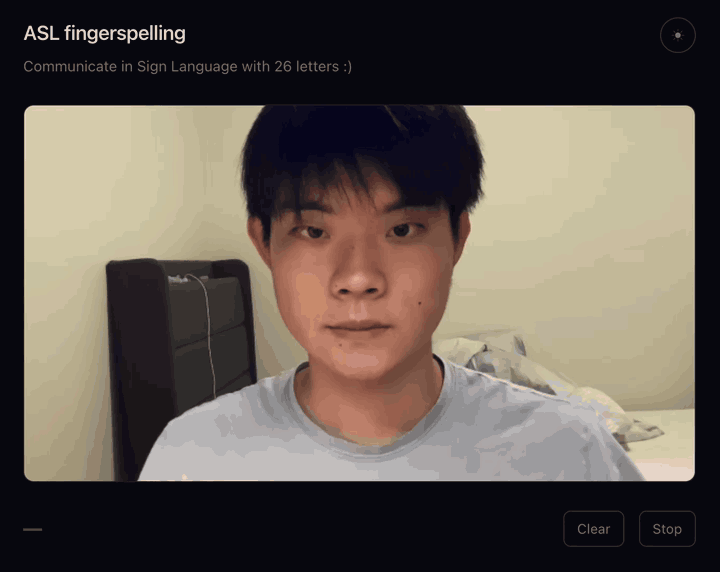

# Real-time American Sign Language Recognition



*Me, on the [hosted page](https://henryyhong.com/ASL-Classification/), in one take. Trimmed and cropped, never sped up — a recognizer's demo is partly a claim about its latency. The last two letters are the ones a single frame cannot express: J and Z are drawn, not held.*


Three attempts at the same problem, kept in the order I built them, because each one exists because of what the last one got wrong.

**A** is a CNN on raw 28x28 pixels: 95-99% on its benchmark, and it collapses onto a handful of classes in front of a webcam. **B** throws the pixels away and classifies MediaPipe's 21 hand landmarks instead: it works live, but only for 24 letters, and its 99.58% is measured on near-duplicate frames from the session it trained on. **C** is what happens when you take that criticism seriously — a motion branch that adds J and Z, a feature that survives a change of day, and a number measured by holding out a whole recording session. It runs in the browser.

### [Try it in your browser →](https://henryyhong.com/ASL-Classification/)

No install, no upload: the model is ~8 MB of JSON, and the camera frames never leave your machine. Chrome or Safari, allow the camera, sign at the box.


*Both screenshots are mine — frames from Approach B's live demo (`RandomForest/Mediapipe.ipynb`, cell 5, which draws the bare predicted letter above the landmark bounding box), captured on my own machine. Neither is from Approach A, whose live demo is the one documented as failing below.*

## Scope

**Approaches A and B cover 24 letters:** A B C D E F G H I K L M N O P Q R S T U V W X Y. **Approach C covers all 26.**

**J and Z are motion signs** — J traces a hook, Z traces a zigzag — and neither is expressible in a single still frame. A single frame of a J *is* an I. Any model that classifies one frame with no temporal state has them outside its label space by construction, which is why A and B stop at 24 and why `temporal/` is a different shape of program rather than a bigger forest.

All three are fingerspelling letter classifiers, not sign language translators: one letter at a time, no words, no grammar, no facial markers, no two-handed signs.

The first two pipelines reach the same 24 letters through different index maps. The CNN inherits Sign-MNIST's `label` column, whose values run 0-24 with 9 (J) never present and 25 (Z) never assigned at all; `LabelBinarizer` collapses that onto 24 output units. The Random Forest uses a contiguous 0-23 map built at capture time: `0:A … 8:I, 9:K, 10:L … 23:Y`.

## The three pipelines at a glance

| | **A — CNN on Sign-MNIST** | **B — landmarks + Random Forest** | **C — `temporal/`, two branches** |
| --- | --- | --- | --- |
| Code | `CNN/ASL_Detection.ipynb` | `RandomForest/Mediapipe.ipynb` | `temporal/*.py`, ported to `docs/*.js` |
| Letters | 24 | 24 | **26** |
| Input representation | 28x28 grayscale pixels (784 values) | 42 floats: 21 landmarks x (x, y) | 101 floats per frame (palm-normalized shape + 55 pairwise distances), and a 79-D arc-length path descriptor for J and Z |
| Training data | Sign Language MNIST (public), 27,455 rows | 2,377 usable landmark vectors from 2,400 frames I recorded myself | 4,878 frames over four sessions + 140 recorded gestures, all mine |
| Model | 3-block CNN, 264,049 params | `RandomForestClassifier()`, 100 trees, 9,452 nodes | Two forests (400 and 300 trees), a six-inequality launch gate, a four-state segmenter |
| Training cost | 20 epochs, ~17-20 s each on an Apple M1 Pro | Seconds | About a minute |
| Headline accuracy | 95.29% saved / 99.69% best epoch | 99.58% random split, 100.00% per-class split (V contributes zero test samples — see caveats) | **0.759 leave-one-session-out**; 0.864 on {J, Z, MOVE} |
| Works in the live demo | No — collapses onto a few classes | Yes, for the session it trained on | Yes — in a browser, on someone else's machine |

The two also differ in provenance, not just representation. Approach A trains on Sign Language MNIST, a public benchmark someone else assembled. Approach B trains on a dataset I built end to end: I wrote the capture cell, recorded all 2,400 frames myself on my own webcam, and labeled them by construction — one folder per letter, 100 frames each. Nothing in `RandomForest/data/` was downloaded.

Both approaches run MediaPipe Hands at inference time, but for different jobs. Approach A uses it only to *locate* the hand, then classifies the pixels inside the box. Approach B classifies the geometry MediaPipe already computed and never looks at a pixel. That difference is the whole repository: raw pixels carry lighting, skin tone, sleeve color and background into the classifier; 42 coordinates do not.

Approach A is invariant to none of those; its crop does remove where the hand sits in the frame, but that crop is then squashed to 28x28 without preserving aspect ratio. Approach B's *features* discard all of them, and hand position with them — though MediaPipe still has to find the hand in the image first, and it found none in 23 of the 2,400 captured frames. Those features are also **not** invariant to distance from the camera, because they are translation-normalized and not scale-normalized. That is its own worst weakness, and it is covered below.

## Repository layout

```
ASL/
├── ASL.code-workspace           VS Code workspace file
├── README.md
├── CNN/
│   ├── ASL_Detection.ipynb      8 cells: install, train, plots, live demo
│   ├── sign_mnist_train.csv     27,455 rows + header, 785 cols (label + 784 px), 83.3 MB
│   ├── sign_mnist_test.csv      7,172 rows + header, same schema, 21.8 MB
│   ├── smnist.h5                3.2 MB — saved by the training cell, loaded by the live demo
│   ├── smnist.keras             3.2 MB — same architecture, DIFFERENT weights (see below)
│   └── asl_model.keras          1.65 MB — leftover from an earlier experiment (see below)
├── RandomForest/
│   ├── Mediapipe.ipynb          7 cells: install, capture, extract, train x2, live demo
│   ├── data/0 … data/23         24 folders x 100 JPGs = 2,400 frames, each 1920x1080
│   ├── data.pickle              912 KB — {'data': [...42 floats...], 'labels': [...]}
│   └── model.p                  2.4 MB — pickled {'model': RandomForestClassifier}
├── temporal/                    Approach C. See temporal/README.md.
│   ├── features.py              the one shared transform: both branches, both languages
│   ├── thresholds.py            every runtime constant, each with the measurement behind it
│   ├── segmenter.py             four-state machine deciding when a letter was actually signed
│   ├── collect_motion.py        recorder for both static letters and J/Z gestures
│   ├── train_static.py          ships model_static.p; characterizes, never selects
│   ├── train_motion.py          ships model_motion.p; GroupKFold over independent clips
│   ├── crossval_static.py       leave-one-session-out — the number the README quotes
│   └── static_s*.npz            the extra sessions, as landmarks rather than JPEGs
└── docs/                        the hosted demo, served by GitHub Pages
    ├── index.html, app.js       camera, overlay, live readout
    ├── features.js, forest.js, segmenter.js   line-for-line ports of the Python
    ├── export_models.py         flattens the forests to models.json
    ├── golden.json              Python's answers for 15 real frames; the page checks itself
    └── make_demo.sh             screen recording -> the GIF at the top of this file
```

`CNN/asl_model.keras` is, like `smnist.keras`, **not** produced by any cell in the notebook. It is a different, earlier architecture — Conv 32/64/128 with `padding='valid'`, Dense 256, Dropout 0.5, and a 25-unit softmax rather than 24 — left over from a first attempt. Nothing in the repository loads it. Use `smnist.h5` — the file the training cell writes and the live demo loads. `smnist.keras` shares the architecture but not the weights: it is a separate, earlier training run, saved 35 minutes before `smnist.h5`, and it is the better model of the two — 98.87% on the test CSV against `smnist.h5`'s 95.29%. Nothing loads it, and none of the accuracy figures below describe it.

Both notebooks use paths relative to their own folder (`sign_mnist_train.csv`, `./data`, `model.p`), so each must be run with that folder as the working directory.

---

## Approach A — CNN on Sign Language MNIST

`CNN/ASL_Detection.ipynb`

```
webcam frame (1080p BGR)
  -> MediaPipe Hands -> 21 landmarks -> bounding box, expanded 20 px per side, clamped to the frame
  -> crop -> BGR2GRAY -> resize to 28x28 -> /255 -> reshape (1, 28, 28, 1)
  -> CNN -> softmax over 24 classes -> top-3 letters printed, top-1 drawn on the frame
```

### Data and preprocessing

`sign_mnist_train.csv` (27,455 rows) and `sign_mnist_test.csv` (7,172 rows) each hold a `label` column plus 784 pixel columns — one 28x28 grayscale image per row. Pixels are divided by 255.0 and reshaped to `(-1, 28, 28, 1)`; labels are one-hot encoded with `LabelBinarizer`. The official 7,172-row test CSV is passed straight to `fit()` as `validation_data`, so every "validation accuracy" below is the benchmark test accuracy.

Augmentation is a Keras `ImageDataGenerator` with `rotation_range=10`, `zoom_range=0.1`, `width_shift_range=0.1`, `height_shift_range=0.1` — small perturbations only, nothing that would change which letter a hand shape is. Training runs on `datagen.flow(...)`, so every epoch sees perturbed copies rather than the raw rows.

### Architecture

Sequential. The per-layer counts below are derived from the layer definitions; they sum to the 264,049 parameters read back from the saved weight file, of which 263,749 are trainable and 300 are BatchNorm moving mean/variance.

| # | Layer | Output shape | Params |
| --- | --- | --- | --- |
| 1 | `Conv2D` 75, 3x3, stride 1, `same`, ReLU | 28x28x75 | 750 |
| 2 | `BatchNormalization` | 28x28x75 | 300 |
| 3 | `MaxPool2D` 2x2, stride 2, `same` | 14x14x75 | — |
| 4 | `Conv2D` 50, 3x3, stride 1, `same`, ReLU | 14x14x50 | 33,800 |
| 5 | `Dropout` 0.2 | 14x14x50 | — |
| 6 | `BatchNormalization` | 14x14x50 | 200 |
| 7 | `MaxPool2D` 2x2, stride 2, `same` | 7x7x50 | — |
| 8 | `Conv2D` 25, 3x3, stride 1, `same`, ReLU | 7x7x25 | 11,275 |
| 9 | `BatchNormalization` | 7x7x25 | 100 |
| 10 | `MaxPool2D` 2x2, stride 2, `same` | 4x4x25 | — |
| 11 | `Flatten` | 400 | — |
| 12 | `Dense` 512, ReLU | 512 | 205,312 |
| 13 | `Dropout` 0.3 | 512 | — |
| 14 | `Dense` 24, softmax | 24 | 12,312 |

Filter counts descend (75 -> 50 -> 25) as the map shrinks 28 -> 14 -> 7 -> 4, so the convolutional stack is cheap and 205,312 of the 264,049 parameters — 78% — sit in the single `Flatten` -> `Dense(512)` transition.

### Training configuration

`adam` with Keras defaults, `categorical_crossentropy`, batch size 128, 20 epochs, 215 steps per epoch, roughly 17-20 s per epoch on an Apple M1 Pro — about six minutes end to end. There are **no callbacks**: no early stopping, no checkpointing. The run finishes with `model.save('smnist.h5')`.

### Results

Selected epochs, from the notebook's own captured output:

| Epoch | Train acc | Train loss | Val acc | Val loss |
| --- | --- | --- | --- | --- |
| 1 | 0.4798 | 1.7338 | 0.1464 | 3.8237 |
| 2 | 0.9153 | 0.2590 | 0.5066 | 1.6500 |
| 3 | 0.9649 | 0.1125 | 0.9795 | 0.0819 |
| 6 | 0.9893 | 0.0358 | 0.9378 | 0.1898 |
| 11 | 0.9912 | 0.0254 | 0.9204 | 0.2401 |
| **12** | 0.9927 | 0.0220 | **0.9969** | **0.0092** |
| 18 | 0.9955 | 0.0159 | 0.9905 | 0.0365 |
| **20** | **0.9961** | **0.0127** | **0.9529** | **0.1594** |

**The validation curve is noisy.** It opens at 14.64%, jumps to 50.66%, reaches 97.95% by epoch 3, and then swings between 0.9204 and 0.9969 for the rest of the run while training accuracy first passes 0.99 at epoch 7 and never falls below 0.9899 thereafter. After the opening ramp, the largest single move between neighbouring epochs is 0.9204 (epoch 11) to 0.9969 (epoch 12) — 7.65 points of held-out accuracy on a training set that has effectively converged. Any single-run figure from this notebook carries an error bar much wider than its last two digits suggest.

**The saved model is not the best model.** With no `ModelCheckpoint` and no `EarlyStopping`, `model.save()` writes whatever weights epoch 20 ended on: 95.29% validation accuracy, val loss 0.1594. The best epoch was 12, at 99.69% and val loss 0.0092. `smnist.h5` — the file the live demo loads — is the epoch-20 model. **The committed model is the 95.29% model, not the 99.69% one.**

### Why it does not work live

From the notebook's own captured run, three consecutive predictions:

```
Predicted Character 1: F, Confidence 1: 99.32%
Predicted Character 2: P, Confidence 2: 0.68%
Predicted Character 3: G, Confidence 3: 0.00%
Predicted Character 1: F, Confidence 1: 99.40%
Predicted Character 2: P, Confidence 2: 0.58%
Predicted Character 3: Y, Confidence 3: 0.02%
Predicted Character 1: F, Confidence 1: 49.12%
Predicted Character 2: P, Confidence 2: 48.09%
Predicted Character 3: G, Confidence 3: 1.24%
```

The full log is 256 predictions spread over just nine letters: `Y` 101 times, `P` 81, `F` 32, `L` 24, and five other letters between one and eight times each. It opens on `Y` at 99.52%, then alternates between `Y` and `P` for most of its length — including unbroken runs of 18 `Y` and 19 `P` — before settling onto a closing run of seven `F`, the last three of which are quoted above. Top-1 barely tracks the sign being made, and most of the time the model is not uncertain about it. It is confident and wrong.

This is a domain gap, not a bug. Sign-MNIST images are tight, centered, uniformly lit 28x28 crops from one controlled pipeline. The live crop is an arbitrary-aspect-ratio rectangle carved out of a cluttered 1080p scene and squashed to 28x28 by `cv2.resize` with no aspect-ratio preservation, carrying whatever the room's lighting and background happened to be. A tall hand gets stretched; a wide one gets squeezed. Nothing in the training distribution looks like that.

A softmax has no way to say so. Trained only on the Sign-MNIST distribution, it cannot report "this input is unlike anything I have seen" — it puts 99% on whichever class the out-of-distribution activations happen to favor. That is why the failure looks like confidence rather than confusion. **95% on a benchmark split says nothing about a webcam**, and the fix is representational, not architectural.

---

## Approach B — MediaPipe landmarks + Random Forest

`RandomForest/Mediapipe.ipynb`

```
webcam frame (1080p BGR)
  -> MediaPipe Hands -> 21 landmarks (x, y) in normalized image coordinates
  -> for each landmark: (x - min_x, y - min_y) -> 42 floats
  -> RandomForestClassifier -> class index -> letter drawn above the hand's bounding box
```

The premise: stop asking one model to learn perception and geometry at once. Let MediaPipe do the perception — hand detection plus 21 keypoints, a job it already does well on far more varied imagery than I could collect — and give the classifier only the geometry. The nuisance variables that broke the CNN are not trained away here; they are never present in the input.

### Step 1 — Capture (cell 1)

`cv2.VideoCapture(1)`; for each of the 24 classes, print the letter, `time.sleep(5)` as a "get ready", then write 100 consecutive frames to `./data/<class_index>/<n>.jpg`. Frames are full-resolution 1920x1080 JPEGs, written straight from the BGR capture buffer by `cv2.imwrite`. 24 x 100 = 2,400 images, every one of them recorded by me, of my own hand, across two sittings on the same day and in two different rooms (22 classes in one continuous pass, then A and B re-captured a few hours later somewhere else) — this is my own dataset, not a downloaded one. The only pause between frames is the loop's own `cv2.waitKey(25)`, so all 100 land within a few seconds, which matters for evaluation and is dealt with below.

### Step 2 — Landmark extraction (cell 2)

For every image: `imread` -> `BGR2RGB` -> `mp_hands.Hands().process()`. If a hand is found, its 21 landmarks become a 42-D vector:

```python
for i in range(len(hand_landmarks.landmark)):
    x = hand_landmarks.landmark[i].x
    y = hand_landmarks.landmark[i].y
    data_aux.append(x - min(x_))   # x_ = all 21 x values
    data_aux.append(y - min(y_))   # y_ = all 21 y values
```

MediaPipe returns `x` and `y` already normalized to [0, 1] against image width and height, so raw landmarks encode where in the room the hand is. Subtracting `min(x_)` and `min(y_)` moves the origin to the top-left corner of the hand's own bounding box, so the vector describes the hand's internal shape instead of its position in the frame.

**What that buys:** translation invariance. Sign the same letter top-left or bottom-right and you get the same 42 numbers. Lighting, skin tone, sleeve color and background are discarded outright, because none of them survive into a coordinate.

**What it does not buy:** scale invariance. The values are still fractions of the *frame*, not of the hand, so a hand held twice as close produces roughly twice the magnitudes. Dividing by the bounding-box extent would fix it. The notebook does not. This is the single largest weakness of the feature.

Result, saved to `data.pickle` as `{'data': [...], 'labels': [...]}`: **2,377 usable vectors out of 2,400 frames (99.0%)**, all exactly 42-dimensional, values ranging 0.0 to 0.6518, with 100 samples for every class **except** class 0 (A) at 99 and class 20 (V) at 78.

Those 23 missing vectors are frames where MediaPipe returned no hand at all. The perception step that makes this approach work is also its single point of failure: no landmarks, no prediction — at extraction time and at inference time alike.

One detail worth knowing before you recapture: the extraction loop iterates `for hand_landmarks in result.multi_hand_landmarks:` and appends into a single `data_aux`, so a frame containing **two** hands yields an 84-D vector rather than 42. That is why both training cells open by filtering out any entry whose length differs from `data_dict['data'][0]`. Samples with a second hand in shot are silently dropped rather than crashing the run.

### Step 3 — Training (cells 3 and 4)

`RandomForestClassifier()` with every scikit-learn default. Read back from the committed `model.p`:

| Property | Value |
| --- | --- |
| `n_estimators` | 100 |
| `criterion` | gini |
| `max_features` | `'sqrt'` — 6 of the 42 features considered per split |
| `max_depth` | `None` — grown until pure |
| Mean tree depth | 12.67 |
| Total nodes across the forest | 9,452 (roughly 95 per tree) |
| `n_features_in_` / classes | 42 / 24 |

Two cells train and evaluate under two different splits, and **both write `model.p`**. The committed pickle is cell 4's: every tree in it was fitted on 1,918 samples, exactly cell 4's training count (23 x 80 + V's 78), against cell 3's 1,901. The model the live demo loads is therefore the one evaluated without a single held-out V.

| Cell | Split | Reported |
| --- | --- | --- |
| 3 | `train_test_split(test_size=0.2, shuffle=True, stratify=labels)` | **99.58%** on 476 test samples (~2 errors) |
| 4 | Per class: shuffle, then `[:80]` train / `[80:100]` test | **100.00%** |

### Step 4 — Live inference (cell 5)

Webcam -> `BGR2RGB` -> MediaPipe Hands -> the *same* 42-feature construction as cell 2 -> `model.predict` -> the letter drawn above the landmark bounding box with the skeleton overlaid. `q` quits.

Feature parity between training and inference is the point: cell 2 and cell 5 apply the same `(x - min(x_), y - min(y_))` arithmetic (cell 5 resets the vector per hand, so it never produces the 84-D two-hand case), so there is none of the train/serve skew that sinks Approach A. This is the demo that actually tracks the sign being made.

---

## What those accuracies actually mean

99.58% and 100.00% are honest measurements of what they measured. They are not evidence that this generalizes, and three things should be stated before anyone quotes them.

**1. The headline number is stable — that is not the issue.** Re-running cell 3's random stratified split under five seeds gives 99.58%, 99.79%, 99.79%, 100.00%, 100.00%. Variance is low; it is not a lucky split. The *split* is the problem, not the noise.

**2. The 100.00% was measured on 23 of the 24 letters.** Cell 4 slices `[80:100]` per class for its test set. Class 20 (V) has only 78 vectors, so that slice is empty and **V contributes zero test samples** — a letter with no test samples cannot be got wrong. (Class 0, at 99 vectors, contributes 19 instead of 20.) The class dropped from the evaluation is precisely the one MediaPipe found hardest to see, which is the last class you would want to stop measuring.

**3. Near-duplicate frames land on both sides of the split.** All 100 frames of a class come from one continuous burst — same hand, same session, same lighting, same background, captured over a few seconds with only the loop's 25 ms `waitKey` between frames. Consecutive frames are near-identical images. A random split therefore puts almost the same frame in train and in test. What the number measures is *"can the forest re-identify frames from the session it was trained on"*, not *"does it recognize a letter signed by a different person, with a different hand size, in a different room."*

A contiguous per-class holdout — train on the first 80% of each class's frames, test on the last 20% — still scores 99.58%. That does not rescue the figure, because that split is drawn from the same burst too. An honest generalization number needs a second capture session, ideally with a different signer, and I have not run one.

So the defensible claim is narrow: the 42-D landmark representation separates these 24 handshapes well enough that an untuned forest solves them, and the live demo runs on a live webcam feed and tracks the letters signed by the signer it was trained on (no frame rate or latency was measured, and the demo still rebuilds the MediaPipe graph every frame). Nothing here supports a claim about a new person or a different hand. A change of room it does appear to survive: the two screenshots at the top were taken in a library, in different clothing and lighting from either capture session, and the demo still reads `A` and `B` correctly — which is what you would expect from a representation that never sees a pixel, but two letters of anecdote is not a measurement. **A benchmark number describes a distribution, not a capability** — which is the same lesson Approach A taught, arriving from the other direction.

---

## Approach C — motion letters, and a number that survives a new day

`temporal/` is the answer to the section above. It covers J and Z, and it measures itself by holding out an entire recording session rather than 20% of one burst. Full write-up in [`temporal/README.md`](temporal/README.md).

| | result | how it was split |
| --- | --- | --- |
| Static letters, in-session | 0.968 | held-out tail of each capture burst — inflated, kept here for contrast |
| **Static letters, leave-one-session-out** | **0.759** | `temporal/crossval_static.py`, pooled over 4,878 held-out frames |
| — the fold that tests all 24 letters | 0.659 | hold out the 2,378-frame archive, train on the later sessions |
| Motion letters {J, Z, MOVE} | 0.864 | `GroupKFold(5)` over 140 independent gestures |
| Motion, at the runtime operating point | 0.915 correct when it fires | same |
| Launch gate on held `I` | 100/100, 0 false of 2,278 | committed archive |
| Segmenter over 157 s of held signs | 0 false triggers, 24/24 letters | committed archive |

Read the per-fold spread, not the mean. Two of the four sessions are targeted re-recordings covering six and four letters, and a fold that tests four well-separated letters scores 1.000 — which is the same trick that made Approach B's 100.00% meaningless, and counting it would earn the same criticism.

**One transform, two branches.** Every frame becomes the same 101-D vector: 21 landmarks centered on the palm and divided by palm width, plus all pairwise distances between fingertips, knuckles and wrist. The distance block is there because a forest splits one coordinate at a time, so "how far apart are these two fingertips" — the whole difference between U and V — otherwise costs it a deep chain of splits. Dividing by palm width is the fix for Approach B's largest weakness: the features are now scale-invariant, so distance from the camera stops changing the answer.

**A gate decides when to look, and it is deliberately not a model.** Six inequalities on finger geometry say whether the hand is in J's or Z's launch pose; a track starts only on a *rising edge* — parked in that pose, and then moving — which is why ordinary hand travel almost never creates a scoring opportunity. Six inequalities fail visibly and can be read straight off the live overlay. An out-of-distribution probability fails confidently, which is the failure mode Approach A is made of.

**Ratios, not lengths.** A finger pointing at the camera projects short, so 2-D distances shrink for reasons that have nothing to do with the handshape. Straightness — tip-to-knuckle distance over the sum of the bone lengths — is a ratio, and it survives that.

**What it actually cost.** Every letter I reported as broken during development turned out to be either a disagreement inside my own recordings or a threshold I had guessed before the data existed — never a weakness in the model. Every `G` frame in one session had an extended middle finger, which is an `H`; the correct frames were outvoted and `G` read as `H` everywhere. `T_MAX` sat *below* the p95 of my own recorded Z durations, clipping real gestures out of the distribution the classifier was fitted on. `P_EMIT` was 0.70 and silently dropped about one genuine gesture in three. Logging what the running system actually saw found all of them; reading the code found none.

**It runs in the browser.** `docs/` is a line-for-line port — same feature code, same thresholds, same forests flattened to JSON. The page checks itself against `golden.json` (15 real frames with the answers Python gives) before the camera ever turns on, and says so in the readout, because a silent Python/JavaScript divergence is the one bug that would look exactly like "the model is bad."

---

## Running it

### Environment

The notebooks were run under Anaconda Python 3.11 on macOS (Apple M1 Pro). Versions observed in their own `pip` output:

| Package | Version |
| --- | --- |
| Python | 3.11 |
| `opencv-python` | 4.10.0.84 |
| `mediapipe` | 0.10.18 |
| `numpy` | 1.24.3 |
| `scikit-learn` | 1.3.0 |
| `matplotlib` | 3.7.2 |
| `tensorflow` / `keras` | Keras 3.x |

There is no `requirements.txt` and nothing is pinned. Each notebook opens with a `%pip install` cell, but note that the CNN's install cell covers only `opencv-python` and `mediapipe` while its training cell imports `tensorflow`, `pandas` and `scikit-learn` — those must already be present. Two version notes: `model.p` was pickled under scikit-learn 1.3.0 and raises `InconsistentVersionWarning` when unpickled under 1.3.2 (it still loads and predicts), and `model.save('smnist.h5')` warns that HDF5 is a legacy format. `smnist.keras` holds a different, earlier training run of the same architecture in the native format (98.87% on the test CSV); the live demo loads `smnist.h5`.

### Approach C — all 26 letters

```
python3.11 -m venv .venv && ./.venv/bin/pip install -r requirements.txt
./.venv/bin/python temporal/live_demo.py --camera 0
```

Python 3.11 and `mediapipe==0.10.18` specifically: MediaPipe 1.0 removed the `mp.solutions` namespace, which breaks this code and both notebooks. `temporal/README.md` has the recording and retraining order. Nothing needs installing to use the [hosted version](https://henryyhong.com/ASL-Classification/).

### Approach A — CNN

Run `jupyter notebook ASL_Detection.ipynb` from inside `CNN/`. The cell numbers below are positions in the notebook file counting from 0 and including the two markdown cells at the top (the title and the `Author:` line) — so cell 2 is the first code cell (`%pip install opencv-python mediapipe`), cell 3 is the training cell, and cell 6 is the live demo, the last cell with any code in it. They are not the `In [n]` execution counts Jupyter displays.

| Cell | What it does | Notes |
| --- | --- | --- |
| 2 | `%pip install opencv-python mediapipe` | Restart the kernel if anything was newly installed |
| 3 | Loads both CSVs, builds and trains the model, saves `smnist.h5` | ~6 minutes for 20 epochs on an M1 Pro |
| 4 | Plots the first three training images | Calls `plt`, but no cell in the notebook runs `import matplotlib.pyplot as plt` — add it or this raises `NameError` |
| 5 | Plots the accuracy and loss curves | Same missing import, and it needs `history` from cell 3, so same session only |
| 6 | Live webcam demo, loads `smnist.h5` | Standalone — skip cells 3-5 to use the committed model |

### Approach B — Random Forest

Run `jupyter notebook Mediapipe.ipynb` from inside `RandomForest/`.

| Cell | What it does | Notes |
| --- | --- | --- |
| 0 | `%pip install mediapipe opencv-python scikit-learn numpy matplotlib` | Restart the kernel if anything was newly installed |
| 1 | Captures 100 frames x 24 classes into `./data/` | **Skip unless recapturing** — it overwrites `data/`. Blocks 5 s per class; be in position |
| 2 | Extracts 42-D landmark vectors -> `data.pickle` | Relies on the `import os` in cell 1 — run it after skipping cell 1 and it raises `NameError`; add `import os` at the top. Slow: it rebuilds the MediaPipe graph per image. `data.pickle` is already committed |
| 3 | Trains on the stratified random split, writes `model.p`, prints accuracy | |
| 4 | Trains on the per-class 80/20 slice, **overwrites `model.p`**, prints accuracy | Run 3 or 4, not both, unless you want the second one's model |
| 5 | Live webcam demo, loads `model.p` | Standalone from the committed pickle |

### Camera index

All three capture sites are hard-coded to the second camera. `RandomForest/Mediapipe.ipynb` cell 1 even says so in a comment:

```python
cap = cv2.VideoCapture(1)  # Change to 0 if you have only the default camera
```

**With only a built-in webcam, this must be `cv2.VideoCapture(0)`** in `CNN/ASL_Detection.ipynb` cell 6 and `RandomForest/Mediapipe.ipynb` cells 1 and 5. A wrong index does not report itself clearly: `cap.read()` returns `ret = False` and `frame = None`. The CNN demo raises at `h, w, c = frame.shape` on a `None` frame. The Random Forest cells are quieter: the live demo (cell 5) hits `if not ret: break` on the first iteration and finishes with no error and no window, and the capture cell (cell 1) breaks out of each inner loop but still walks all 24 classes, printing `Collecting data for class ...` and sleeping 5 s each — about two minutes of looking busy while writing no frames at all.

---

## Known limitations and next steps

In rough order of how much they matter:

- **The landmark features are not scale-normalized.** 42 values expressed as fractions of the frame mean predictions shift with how far the hand is from the camera. Dividing each coordinate by the hand's bounding-box extent after the `(x - min)` shift would make the representation size-invariant, and is the highest-value single change to this repository.
- **The dataset is one signer, one hand, one day.** The two sittings differ in room but not in signer, hand or day, so they do not function as independent sessions and cannot be split against each other. Train on session 1, test on session 2 — different day, different lighting, ideally a different person — is what turns 99.58% into a number that means something.
- **Class 20 (V) has 78 samples, not 100.** It is under-represented in training and, under cell 4's split, untested. Recapturing V is cheap.
- **`mp_hands.Hands()` is constructed inside the per-frame loop** in the Random Forest notebook — the extraction cell and the live demo both rebuild the entire MediaPipe graph every iteration instead of once. The extraction cell's captured output carries 2,400 `gl_context` initialization lines — exactly one per image — and the live demo's carries 448. (The CNN demo already builds it once above its loop.) Hoisting it out is a straight throughput win.
- **The capture loop writes 100 frames back to back,** pausing only for the loop's `cv2.waitKey(25)`, which is why frames within a class are near-duplicates. A substantially longer delay, plus deliberate repositioning between frames, would make 100 images worth 100 images at the same capture cost.
- **The CNN has no checkpointing.** `ModelCheckpoint(save_best_only=True)` on validation accuracy would have saved the epoch-12 model at 99.69% instead of the epoch-20 model at 95.29%; early stopping on validation loss would also cut the wasted epochs.
- **The CNN's live crop is squashed, not letterboxed.** `cv2.resize` to 28x28 ignores aspect ratio, so a tall crop is distorted before the model sees it. Padding to a square first would remove one term of the domain gap; the lighting, resolution and background terms would remain.
- **The camera index is hard-coded** in three places rather than being one constant.
- **No pinned dependencies.** A `requirements.txt` at the versions above would make the notebooks reproducible rather than approximately reproducible.
- **Large artifacts are committed:** `sign_mnist_train.csv` at 83.3 MB, `sign_mnist_test.csv` at 21.8 MB, and 2,400 full-resolution JPEGs. The captured frames have to live somewhere, but Sign-MNIST is a public dataset and could be fetched on demand instead of vendored.

Approach C fixes the first three of those — scale-normalized features, a second, third and fourth capture session, and a V recorded properly — and leaves the notebooks themselves untouched, since their failures are the point of keeping them.

Three things I would build rather than fix — written before `temporal/` existed, and all three are now in it:

- **An unknown / no-hand rejection path**, so a model can decline to answer instead of asserting a letter at 99% confidence. Approach A's failure mode is precisely the absence of one.
- **A small MLP on the same 42-D features**, to find out whether the representation or the classifier is the binding constraint. Nothing in this repository currently distinguishes the two.
- **A temporal buffer over the last N frames** — majority voting would stop single-frame flicker reaching the display, and classifying a *sequence* of 42-D vectors is the only route to J and Z, which the single-frame setting cannot reach at all.

They became, respectively: the emission rule that abstains unless a vote is either confident or decisive; the 101-D feature, whose distance block is exactly the test of whether the representation or the classifier was binding; and the vote window plus the motion branch. What none of them fixed is the one limitation that outlived every rewrite — **it is still one signer.** Nothing here says anything about a different person's hands, and everyone who opens the hosted demo is a different person.

---

## Credits and provenance

Approach A trains on **Sign Language MNIST**, a public dataset. Hand detection and 21-keypoint extraction in both approaches use **Google's MediaPipe Hands**.

Everything else here is my own work: the 2,400-frame dataset in `RandomForest/data/` — captured, labeled and curated by me — the four further capture sessions and 140 recorded J/Z gestures behind `temporal/`, the capture, training and inference code in all three approaches, the browser port, and the screenshots above.
